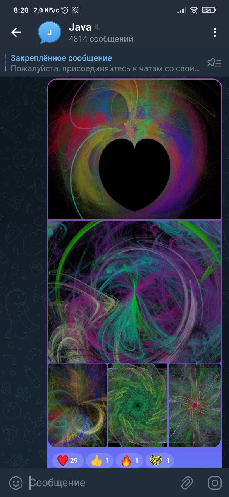

# Проект 4 - Фрактальное пламя

Программа при запуске запрашивает параметры генерации пламени,
а затем запускает алгоритм генерации, по окончании работы 
которого в выходной файл запишется сгенерированное изображение, 
а в консоль выведется время генерации.

### Сравнительные результаты времени работы

Параметры тестирования:

- Количество аффинных преобразований: 10

- Нелинейные преобразования: Spherical

- Размер итогового изображения: 3840 x 2160

- Рабочая область: -2 -1.125 4 2.25

- Количество осей симметрии: 3

- Количество начальных пикселей: 1000

- Количество итераций на пиксель: 10000

- Количество потоков в многопоточном режиме: 16

Время работы однопоточной версии: 6.6 с

Время работы многопоточной версии: 2.5 с

### Примеры генераций

